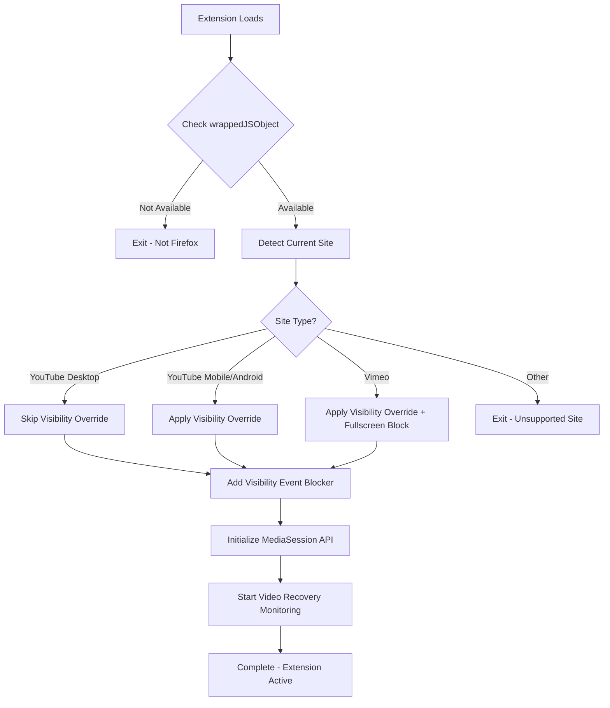

# Architecture

## Overview

Play YouTube Video In Background is a Firefox extension that enables continuous video playback when Firefox is minimized, in the background, or when switching tabs. This document explains how the extension works technically.

## Core Mechanisms

The extension uses two primary techniques to enable background playback:

### 1. Page Visibility API Override

The extension overrides the Page Visibility API to trick websites into thinking the page is always visible.

**How it works**:
- Uses Firefox's `document.wrappedJSObject` to access the underlying page object
- Overrides `document.hidden` to always return `false`
- Overrides `document.visibilityState` to always return `'visible'`

**Code location**: Lines 26-42 in `play-youtube-video-in-background.js`

**Why Firefox-specific**: The `wrappedJSObject` property is part of Firefox's Xray vision security model, which allows extensions to interact with page objects while maintaining security boundaries.

### 2. Event Blocking

The extension prevents visibility change events from reaching the page scripts.

**How it works**:
- Listens for `visibilitychange` events in the capture phase
- Calls `stopImmediatePropagation()` to prevent the event from reaching page scripts
- For Vimeo, also blocks `fullscreenchange` events

**Code location**: Lines 44-58 in `play-youtube-video-in-background.js`

**Event flow**:
```
Browser detects tab switch
    ↓
Extension intercepts visibilitychange event (capture phase)
    ↓
Extension blocks event propagation
    ↓
Page scripts never receive the event
    ↓
Video continues playing
```

### 3. MediaSession API Integration

The extension integrates with the browser's MediaSession API for enhanced mobile support.

**How it works**:
- Registers as a media player with the OS
- Handles system media controls (play, pause, stop)
- Provides metadata for media notifications
- Prevents system from pausing playback when backgrounded

**Code location**: Lines 85-129 in `play-youtube-video-in-background.js`

**Why needed**: Mobile operating systems aggressively suspend background tabs. MediaSession integration signals that active media playback is occurring, reducing the likelihood of suspension.

### 4. Video Playback Recovery

Monitors video state and automatically resumes if unexpectedly paused.

**How it works**:
- Checks video element state every 3-5 seconds
- Detects unexpected pauses (not user-initiated)
- Automatically calls `video.play()` to resume
- Requires consecutive pauses before recovery (avoids interfering with user actions)

**Code location**: Lines 135-174 in `play-youtube-video-in-background.js`

**Why needed**: Even with Page Visibility override, browsers may still pause videos due to resource management or OS-level suspension.

> **Note**: This extension focuses purely on background playback. For preventing YouTube's "Are you still watching?" timeout prompts, install the complementary [YouTube Uninterrupted](https://github.com/LabinatorSolutions/youtube-uninterrupted) extension.


## Site Detection

The extension uses regex patterns to detect supported sites:

### YouTube Detection
```javascript
const YOUTUBE_REGEX = /(?:^|.+\.)youtube(?:-nocookie)?\.com$/;
```

**Matches**:
- `youtube.com`
- `www.youtube.com`
- `m.youtube.com` (mobile)
- `youtube-nocookie.com`
- `www.youtube-nocookie.com`

### Vimeo Detection
```javascript
const VIMEO_REGEX = /(?:^|.+\.)vimeo\.com$/;
```

**Matches**:
- `vimeo.com`
- `www.vimeo.com`
- `player.vimeo.com`

## Platform-Specific Behavior

### Desktop YouTube
- Page Visibility override is **NOT** applied (Desktop YouTube handles background playback natively)
- MediaSession integration **IS** applied for consistency
- Video recovery monitoring **IS** applied

### Mobile YouTube / Android
- Page Visibility override **IS** applied
- MediaSession integration **IS** applied (critical for mobile)
- Video recovery **IS** applied with shorter intervals (3s vs 5s)

### iOS
- Page Visibility override **IS** applied  
- MediaSession integration **IS** applied
- Video recovery **IS** applied

### Vimeo (All platforms)
- Page Visibility override **IS** applied
- Fullscreen event blocking **IS** applied
- MediaSession integration **IS** applied
- Video recovery **IS** applied


## Code Flow Diagram



## Security Considerations

### Content Security Policy
The extension includes a CSP to prevent malicious script execution:
```json
"content_security_policy": {
  "extension_pages": "script-src 'self'; object-src 'none';"
}
```

### Permissions
- **No special permissions required** beyond content script injection
- Extension only runs on YouTube and Vimeo domains
- No network requests made
- No data collection or storage

### Firefox Xray Vision
- `wrappedJSObject` access is sandboxed by Firefox
- Extension cannot access sensitive page data
- Page scripts cannot access extension code

## Performance Impact

### Memory
- Minimal: Single setInterval timer for video monitoring per tab
- MediaSession API has negligible memory footprint
- No memory leaks (timers cleaned up properly)

### CPU
- Negligible: Video check runs every 3-5 seconds
- No continuous polling or heavy computations
- Event-driven architecture

### Network
- Zero: No external requests
- All processing happens locally

### Battery (Mobile)
- Minimal impact due to optimized intervals
- MediaSession integration is battery-efficient
- Shorter check intervals on mobile (3s) balanced against battery life

## Limitations

1. **Firefox Only**: Relies on `wrappedJSObject` which is Firefox-specific
2. **Supported Sites**: Only YouTube and Vimeo
3. **Desktop YouTube**: Background playback often works natively; extension adds recovery mechanism
4. **Browser Forks**: May not work on Firefox forks without `wrappedJSObject` support
5. **Timeout Prompts**: Does NOT prevent "Are you still watching?" dialogs - use [YouTube Uninterrupted](https://github.com/LabinatorSolutions/youtube-uninterrupted) for that


## Future Enhancements

Potential improvements for future versions:

1. **Additional Sites**: Twitch, Dailymotion, etc.
2. **User Preferences**: Options page for customization
3. **Video Detection**: Only apply recovery when video is actively playing
4. **Smart Recovery**: Detect pause reason (user vs system)
5. **Cross-Browser**: Explore Chromium compatibility (limited by API differences)
6. **Wake Lock API**: Experimental support for preventing system sleep

## Complementary Extension

For a complete uninterrupted YouTube experience, consider pairing with:

**[YouTube Uninterrupted](https://github.com/LabinatorSolutions/youtube-uninterrupted)**
- Prevents "Continue watching?" timeout dialogs
- Activity simulation to reset YouTube's idle timer
- Focuses on dialog removal (this extension focuses on background playback)
- Together they provide seamless, uninterrupted playback


## Technical References

- [Page Visibility API (MDN)](https://developer.mozilla.org/en-US/docs/Web/API/Page_Visibility_API)
- [Firefox Xray Vision](https://developer.mozilla.org/en-US/docs/Mozilla/Add-ons/WebExtensions/Sharing_objects_with_page_scripts)
- [MediaSession API (MDN)](https://developer.mozilla.org/en-US/docs/Web/API/MediaSession)
- [HTMLMediaElement API](https://developer.mozilla.org/en-US/docs/Web/API/HTMLMediaElement)
- [WebExtensions Content Scripts](https://developer.mozilla.org/en-US/docs/Mozilla/Add-ons/WebExtensions/Content_scripts)
